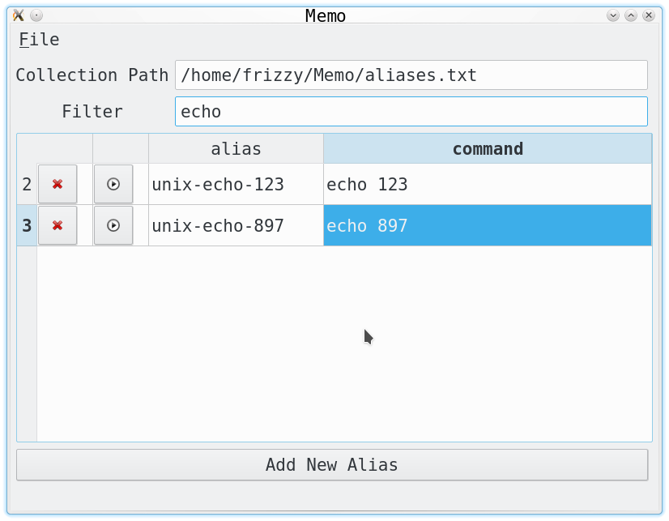

# Memo
This program can help you manage all your shell commands and macros.  
By default it's create `Memo` directory in your home folder with initial `aliases.txt` file.  
On unix systems you can just clone it into your home folder and start working with it:
```
cd ~/
git clone https://github.com/Friz-zy/Memo
cd Memo
./bin/Memo
```

When you'll save your changes into the file, Memo also create two addition files for unix and windows.  
You can use it for setup your aliases in the shell. For examle in unix you can do this one:
```
source ~/Memo/aliases.sh
```
or even add it into your `~/.bashrc`:
```
if [ -f ~/Memo/aliases.sh ]; then
    . ~/Memo/aliases.sh
fi
```

*Tip: you can use filter for searching showing only necessary subset of commands*  


**If you want also store your aliases, you can fork this repo and use git for keeping track of all your changes ^_^**

* [How to fork a repo](https://help.github.com/articles/fork-a-repo/)
* [How to use Git for tracking all your changes even without fork](https://githowto.com/)

**If you want execute it from source form or build binary for Windows, you should install also dependencies:**

*ubuntu and other deb based*
```
sudo apt-get install python-pyside python-six
```

*centos and other rpm based*
```
sudo yum install qt-devel cmake python-devel python-pip
sudo ln -s /usr/bin/qmake-qt4 /usr/bin/qmake
sudo pip install pyside six
```

**For building binary form you need pybuilder**
```
sudo pip install pyinstaller
cd src/
pyinstaller --onedir --windowed main.py
```

*Note: with pyinstaller you can create single static linked binary withput dozen of addition libraries around but QT licensing is LGPLv2 - that's mean that all project should be licensing as LGPLv2 too. From my side, I grant this permissions: you can create project based on this one and use QT license (currently LGPLv2) as main license for whole project*


Created by Filipp Kucheryavy for his friend Vladimir Kataev :)

Challenge 'with asterisk': you can create similar program with spreadshit program like [Excel](https://en.wikipedia.org/wiki/Microsoft_Excel) or [LibreOffice Calc](https://en.wikipedia.org/wiki/LibreOffice) and Basic macros language =D
